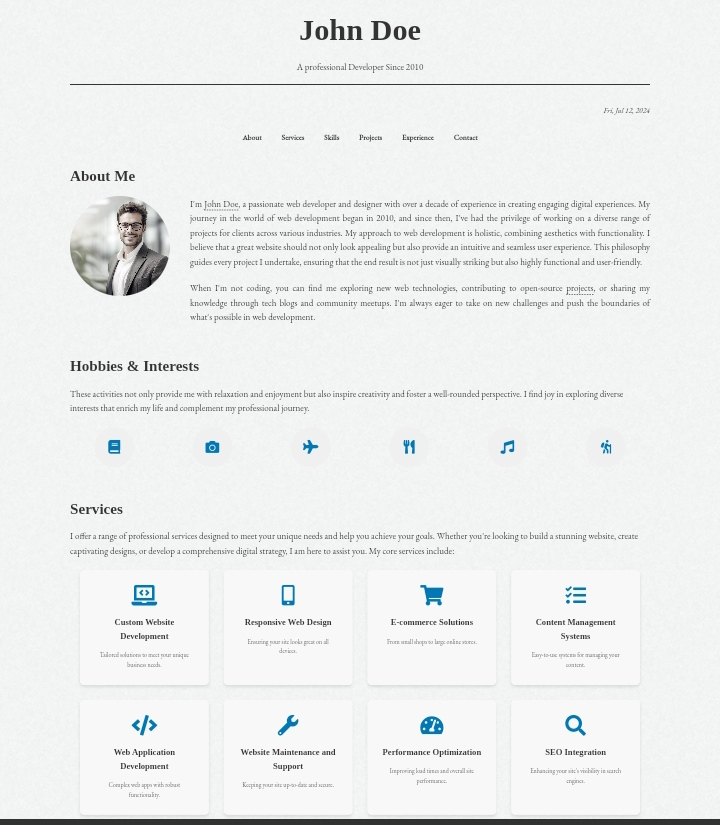

# John Doe Portfolio Web Template

A responsive newspaper-themed web template designed for showcasing a personal portfolio. It features a clean and modern design, suitable for developers, designers, and creatives looking to present their work effectively online.

## Features

- **Responsive Design**: Ensures optimal viewing experience across a wide range of devices.
- **Customizable**: Easily customize sections and content to fit personal preferences.
- **Portfolio Showcase**: Dedicated sections for projects, skills, and contact information.
- **Integrated Contact Form**: Allows visitors to get in touch seamlessly.
- **Modern Design**: Clean layout with emphasis on visual appeal and usability.

## Usage

1. **Clone the Repository**:
   ```
   git clone https://github.com/JohnDev19/John-Doe-Web-Template-Portfolio.git
   ```

2. **Customize Content**:
   - Modify `index.html` to update your personal information and portfolio projects.
   - Adjust CSS styles in `styles.css` to match your branding or preferred aesthetic.

3. **Deploy**:
   - Upload the contents to your web server or use a hosting service like GitHub Pages.

## Preview



## License

This project is licensed under the MIT License - see the [LICENSE](LICENSE) file for details.
